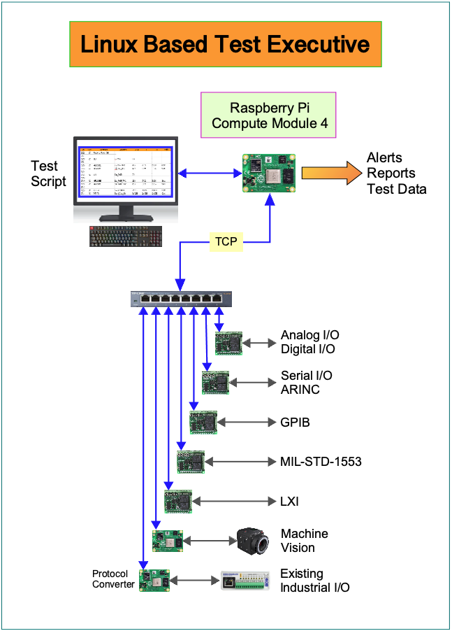
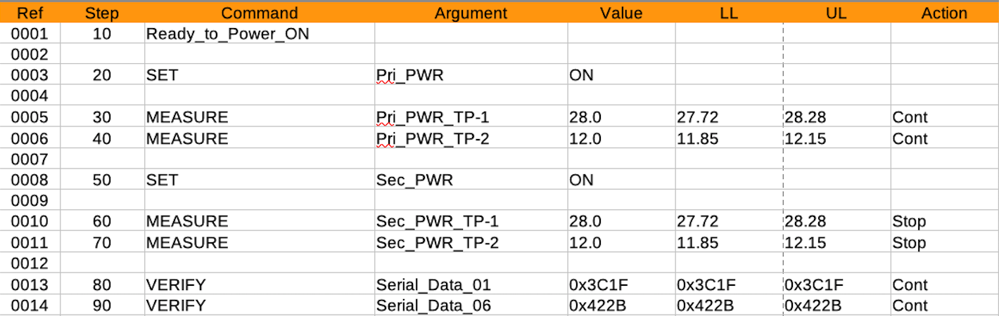

# KDT Linux Test Executive Development

#### Overview

This is the overview for a structured Test Executive program intended primarily for hardware/systems testing. It will be designed to run on Linux systems.  The program will have a spreadsheet type script generator that requires minimal if any software coding in order to execute.  It is intended to develop and run automated and semi-automated test systems and be used by Systems and Hardware Engineers using simple spreadsheet commands.  

Designed to run on a main Linux distribution ideally RHEL or maybe CentOS Stream.

One major goal of this project is to be able to run the Executive on various Linux machines.  It could reside on a high-end server and it could also run on a Raspberry Pi.  An advantage to that is that overall test development could be accomplished very inexpensively during the development phase.  It would be ideal if the I/O hardware could also accomplished on Raspberry Pi and similar modules yielding a very inexpensive overall test system. 

The KDT Test-Executive is comprised of numerous elements when you look at the overall test system:

The Test Executive would actually just be the software residing on the Compute Module 4 in the diagram above.  This Executive is intended to test hardware so there needs to be hardware interfaces that are compatible with the Test Executive structure hence the additional elements in the diagram above.

#### Spreadsheet Based Script Generator

A spreadsheet based script generator that will permit a complete test script to be generated with basic spreadsheet commands.  The generator will use LibreOffice natively and can also convert test scripts generated with Microsoft Excel.  The spreadsheet would look similar to that below and allow easy entry of commands, expected results, limits, actions, etc. 

#### Test Executive

A test executive screen that looks very similar to the script generator above but now with event times, measurements and results filled it.  This is also the screen of the executive that is controlling the test.  Here is where the test is started, paused, stopped.  It can also be run automatically or single stepped for troubleshooting or test development.

The Text Executive would be written in C/C++ to insure minimum latency during test execution. However initial code could easily be written in Python to speed up development.

The actual test script that is running would be interpreted running for the most part one step at a time.  If the "step" is a single task then just that step would be run.  If a step is part of a group of related steps then the executive would be aware of that and run that group of steps.

#### Test Execution Widgets

A variety of meters, indicators, gages, switches, LEDs and controls that can be easily created, sized, located on the test computer display.  These widgets should be easy to create and assign to a measurement # and then display current values.  Should be able to pick from a library of widgets, resize/locate as desired and assign to a measurement number.

#### Hardware I/O Drivers

There is not expected to be any hardware I/O on the CM4 board that is running the test executive.  The executive board will communicate with various I/O boards using TCP messaging.  There could be a wide variety of I/O boards depending on the system being tested and the interfaces required.  These boards could have analog and digital I/O, serial communication including RS-232, RS-485, ARINC and others.  There would also be MIL-STD-1553 interfaces.  Ideally the hardware I/O boards would be CM4 Carrier Boards each with the appropriate hardware interface circuits.  Some are available now and others will need to be designed.

Would like to have the software interface on these boards also spreadsheet based.  It seems like I/O pin assignments, measurement names and measurement types could be entered using a spreadsheet.  The difference between the I/O boards and the Executive board would be that the I/O functionality on these boards might be initially entered using the spreadsheet method however it would then be compiled to run as an executable to maintain the lowest latency from I/O event to message sent.  Would like the software for these I/O boards be downloadable from the Executive processor perhaps at runtime.

#### Hardware I/O Simulator

Since there needs to be an easy way to verify the test script and it is usually desirable to not be doing this on end item hardware it would be useful to have a way to simulate the I/O interfaces.  A Hardware I/O Simulator would also programmable using spreadsheets.  

#### Where's The Code?

One aspect of this project is perhaps a little unique is that I’m not contributing any of the code.  I’m a Systems Engineer who would like to see this type of software made available so am asking the community to contribute.  And therefore looking for an experienced contributor to work with me to structure the effort.

#### ToDo

- Identify an individual who sees merit in this project and the approach overall and can take the lead in software development.
- Further define the structure, components and requirements that will then allow individual contributors add to the project.

#### Contact

Please contact me to discuss any aspect of the project

Jared Kondratuk

kdtelectric@earthlink.net
